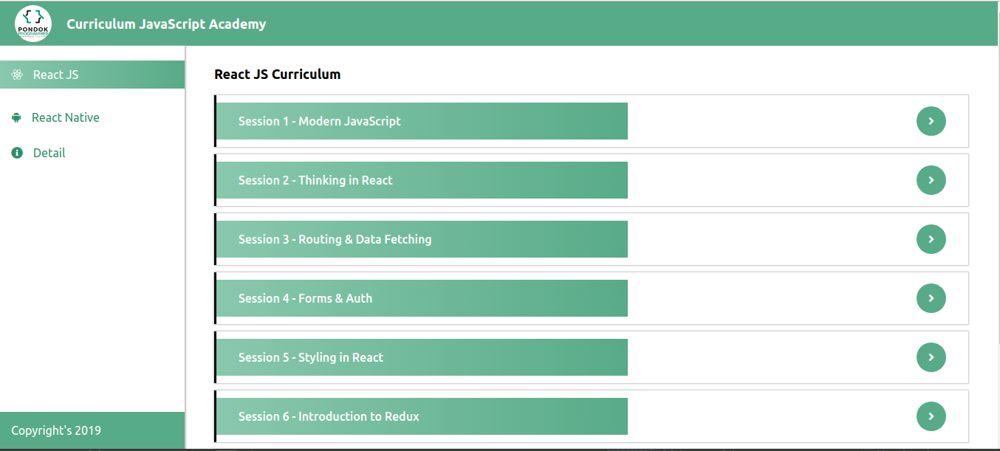
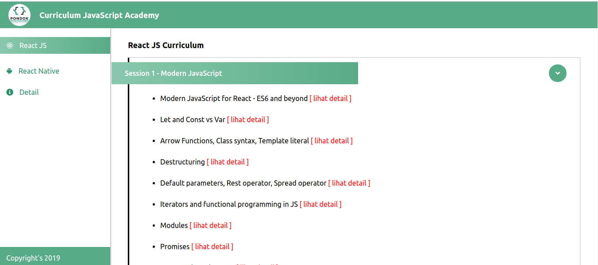
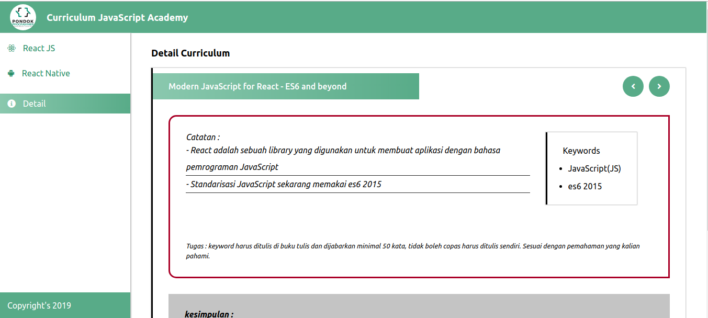

### I Wait Your Contribution

- You can contribute in this project...
- Please follow my github account to know my activity
- Give star to this project, to appreciate this project :)
- Please fork this project repository by clicking fork button 
- Open terminal and type git clone (https://your-github-name/curriculum-react)
- Open directory, cd /curriculum-react
- npm start to run this project in your browser
- you can change file master.json in /src/config/master.json
- you can add more features or any contribution
- Pull request to my repo
- Comment your pull request
- I will give you thank's for your contribution :)

<table>
    <tr>
        <td></td>        
    </tr>
    <tr>        
        <td></td>        
    </tr>
    <tr>        
        <td></td>
    </tr>
</table>
